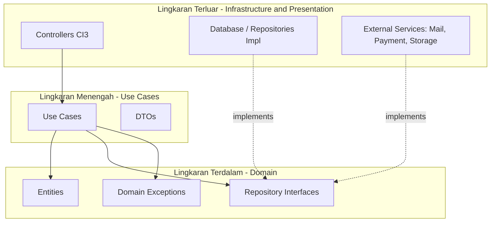

# AGENTS.md — Panduan AI Coding Agent untuk CodeIgniter 3 (Clean Architecture)

Dokumen ini adalah **sumber kebenaran (source of truth)** bagi AI Coding Agent (Antigravity, Claude Code, Cursor, dll.) saat mengembangkan, memelihara, atau melakukan debug pada project ini. Baca dokumen ini secara penuh sebelum menulis kode apa pun. Jika ada perintah dari user yang bertentangan dengan aturan di sini, **konfirmasi dulu** ke user sebelum melanggar arsitektur.

---

## 1. Ringkasan Proyek

| Item             | Detail                                                                                                |
| ---------------- | ----------------------------------------------------------------------------------------------------- |
| Framework        | CodeIgniter 3.x                                                                                       |
| Bahasa           | PHP (cek versi aktual di `composer.json` / server — jangan asumsikan)                                 |
| Arsitektur       | Clean Architecture (Domain → UseCase → Infrastructure → Presentation)                                 |
| Namespace bisnis | `App\` (PSR-4, di-autoload dari `application/src/`)                                                   |
| Database         | MySQL/MariaDB via CI3 Query Builder (Active Record)                                                   |
| Autentikasi      | Lihat `application/src/Domain/Entities/User.php` & `App\UseCases\LoginUseCase` sebagai referensi pola |

> Project ini **bukan** CI3 standar berbasis Fat Controller + Model Active Record. Semua logika bisnis **wajib** hidup di `application/src/`, bukan di `application/controllers/` maupun `application/models/`.

---

## 2. Perintah & Setup Umum

Sebelum menjalankan perintah di bawah, cek dulu apakah file terkait (`composer.json`, `phpunit.xml`, `.env`) benar-benar ada di project — jangan berasumsi.

```bash
# Install dependency (autoloader Composer dipakai untuk PSR-4 App\)
composer install

# Regenerate autoloader setelah menambah class/namespace baru
composer dump-autoload -o

# Jalankan server lokal bawaan PHP (development)
php -S localhost:8080 -t .

# Jalankan migration (jika library migration CI3 diaktifkan)
php index.php migrate

# Jalankan unit test (Domain & UseCase layer — tanpa bootstrap CI3)
vendor/bin/phpunit

# Jalankan test spesifik
vendor/bin/phpunit --filter LoginUseCaseTest
```

**Aturan untuk AI Agent:** jangan mengasumsikan tool test/lint tertentu tersedia. Cek `composer.json` → `scripts` dan `require-dev` terlebih dahulu. Jika tidak ada PHPUnit, tanyakan ke user apakah perlu disiapkan sebelum menulis test.

---

## 3. Struktur Folder Lengkap

```
capaian/
├── application/
│   ├── config/                # Konfigurasi CI3 (termasuk PSR-4 Autoloader di config.php)
│   │   ├── autoload.php
│   │   ├── config.php
│   │   ├── database.php
│   │   └── routes.php
│   ├── controllers/           # Presentation Layer — HTTP Adapter (CI3 Controller)
│   ├── views/                 # Presentation Layer — UI (HTML/PHP/JS)
│   ├── helpers/                # Helper CI3 murni (formatting, string, dsb) — TIDAK boleh berisi business rule
│   ├── libraries/              # Library CI3 custom (mis. wrapper 3rd-party) — dipanggil hanya dari Infrastructure/Controller
│   ├── models/                 # Query layer CI3 asli (extends CI_Model). Berisi query Active Record MENTAH.
│   │                           # Dipanggil HANYA dari Infrastructure Repository — lihat §4.3 & §5.4
│   └── src/                    # LOGIKA BISNIS UTAMA (Namespace: App\)
│       ├── Domain/             # Lingkaran Terdalam (Enterprise Business Rules)
│       │   ├── Entities/       # Objek bisnis murni (PHP murni, tanpa dependency CI3)
│       │   ├── Repositories/   # Interface / kontrak akses data (abstraksi)
│       │   ├── Exceptions/     # Domain-specific exceptions (mis. InvalidCredentialsException)
│       │   └── ValueObjects/   # (opsional) Value Object immutable, mis. Email, Money
│       ├── UseCases/           # Lingkaran Menengah (Application Business Rules)
│       │   ├── DTO/            # Request & Response DTO per fitur
│       │   └── ...UseCase.php  # Satu class per alur kerja/fitur spesifik
│       └── Infrastructure/     # Lingkaran Terluar (Framework & Drivers)
│           ├── Repositories/   # Implementasi konkret dari Domain\Repositories
│           └── Services/       # Integrasi eksternal (email, payment gateway, storage, dsb)
├── tests/
│   ├── Unit/
│   │   ├── Domain/             # Test Entity & Value Object (PHP murni)
│   │   └── UseCases/           # Test UseCase dengan mock Repository
│   └── Integration/
│       └── Infrastructure/     # Test Repository konkret terhadap DB test (opsional)
├── composer.json
└── phpunit.xml
```

> **Catatan model legacy:** jika project sudah punya file di `application/models/`, JANGAN hapus tanpa diminta. Tapi untuk **fitur baru**, semua akses data wajib lewat `App\Infrastructure\Repositories`, bukan CI3 Model.

---

## 4. Aturan Utama Clean Architecture (The Dependency Rule)

> [!IMPORTANT]
> Kode di lingkaran dalam **tidak boleh mengetahui apa pun** tentang kode di lingkaran luar. Dependency hanya boleh mengarah ke dalam (inward).



### 4.1 Domain Layer (`App\Domain`)

- **Entities**: objek PHP murni yang merepresentasikan data & aturan bisnis kritis.
  - Dilarang mengimpor library CI3, helper CI3, atau class dari UseCase/Infrastructure.
  - Properti di-enkapsulasi (`private`/`protected`), diakses via getter/setter atau method perilaku.
  - Validasi invariant bisnis (mis. "email harus valid", "saldo tidak boleh negatif") ditaruh di sini, bukan di Controller.
- **Repository Interfaces**: hanya `interface`, tanpa logika query/SQL/Active Record.
- **Domain Exceptions**: exception custom untuk pelanggaran aturan bisnis (mis. `InsufficientBalanceException`), dilempar dari Entity atau UseCase, ditangkap di Controller.

### 4.2 UseCase Layer (`App\UseCases`)

- Satu class = satu alur kerja/fitur (Single Responsibility). Mengorkestrasi Entities & Repository Interface.
- **DTO**: struktur data masuk (Request) & keluar (Response).
  - UseCase **tidak boleh** menerima `$_POST`, objek `CI_Input`, atau input HTTP mentah lainnya — harus DTO.
  - UseCase **tidak boleh** mengembalikan entity DB mentah/Active Record — bungkus dengan Response DTO.
  - **Dilarang keras** query database langsung di UseCase. Semua akses data lewat Repository Interface yang disuntik via constructor.

### 4.3 Infrastructure Layer (`App\Infrastructure`)

- **Repositories**: implementasi konkret dari interface di Domain. Repository **tidak menulis query Active Record sendiri** — query sesungguhnya didelegasikan ke **CI3 Model** (`application/models/`), lalu Repository memetakan hasilnya ke Domain Entity. Pembagian tanggung jawabnya:
  - **CI3 Model** (`application/models/..._model.php`, `extends CI_Model`): satu-satunya tempat yang boleh menulis query Active Record (`$this->db->...`) atau raw SQL dengan **query binding** (`?` placeholder, jangan concat string). Model **hanya** mengembalikan data mentah (array/`stdClass`) — **dilarang** mengembalikan Domain Entity dari Model.
  - **Infrastructure Repository** (`App\Infrastructure\Repositories`): memuat Model via `$this->CI->load->model('user_model')`, memanggil methodnya, lalu memetakan hasil array/`stdClass` ke Domain Entity lewat method mapping privat (mis. `mapRowToEntity(array $row): User`). Gunakan `get_instance()` untuk akses super object CI3: `$this->CI =& get_instance();`.
  - **Aturan ketat**: Model **hanya** boleh dipanggil dari Infrastructure Repository. Controller dan UseCase **dilarang** memanggil `$this->load->model()` atau method Model secara langsung.
  - Method Repository **wajib** mengembalikan Domain Entity (atau array of Entities) ke pemanggilnya (UseCase), **tidak pernah** meneruskan raw `stdClass`/array DB mentah dari Model.
- **Services**: wrapper untuk integrasi eksternal (email, payment gateway, file storage). Juga di-abstraksi lewat interface di Domain jika UseCase perlu memanggilnya (mis. `NotifierInterface`).

### 4.4 Presentation Layer (`application/controllers` & `application/views`)

- Controller hanya boleh:
  1. Validasi request HTTP (`$this->form_validation`).
  2. Mapping input form → Request DTO.
  3. Memanggil UseCase.
  4. Menangani session/flashdata & redirect.
  5. Merender View atau mengembalikan JSON response.
- **Dilarang keras** menulis logika bisnis atau query database di Controller.
- Controller bertindak sebagai **Dependency Resolver** di constructor: instansiasi Repository konkret → inject ke UseCase.
- View hanya menampilkan data yang sudah di-escape (`html_escape()` CI3 atau `htmlspecialchars()`). Dilarang memanggil Repository/UseCase/DB dari View.

---

## 5. Contoh Implementasi End-to-End (Referensi Pola)

Gunakan pola di bawah sebagai template, sesuaikan nama/field dengan fitur yang diminta.

### 5.1 Domain Entity

```php
<?php
namespace App\Domain\Entities;

class User
{
    private int $id;
    private string $name;
    private string $email;
    private string $passwordHash;

    public function __construct(int $id, string $name, string $email, string $passwordHash)
    {
        $this->id = $id;
        $this->name = $name;
        $this->email = $email;
        $this->passwordHash = $passwordHash;
    }

    public function id(): int { return $this->id; }
    public function name(): string { return $this->name; }
    public function email(): string { return $this->email; }

    public function verifyPassword(string $plainPassword): bool
    {
        return password_verify($plainPassword, $this->passwordHash);
    }

    public function rename(string $newName): void
    {
        if (trim($newName) === '') {
            throw new \App\Domain\Exceptions\InvalidNameException('Nama tidak boleh kosong');
        }
        $this->name = $newName;
    }
}
```

### 5.2 Domain Repository Interface

```php
<?php
namespace App\Domain\Repositories;

use App\Domain\Entities\User;

interface UserRepositoryInterface
{
    public function findByEmail(string $email): ?User;
    public function findById(int $id): ?User;
    public function save(User $user): bool;
}
```

### 5.3 UseCase + DTO

```php
<?php
namespace App\UseCases\DTO;

class LoginRequest
{
    public function __construct(
        public readonly string $email,
        public readonly string $password
    ) {}
}
```

```php
<?php
namespace App\UseCases\DTO;

class LoginResponse
{
    public function __construct(
        public readonly int $userId,
        public readonly string $name,
        public readonly string $email
    ) {}
}
```

```php
<?php
namespace App\UseCases;

use App\UseCases\DTO\LoginRequest;
use App\UseCases\DTO\LoginResponse;
use App\Domain\Repositories\UserRepositoryInterface;
use App\Domain\Exceptions\InvalidCredentialsException;

class LoginUseCase
{
    private UserRepositoryInterface $userRepository;

    public function __construct(UserRepositoryInterface $userRepository)
    {
        $this->userRepository = $userRepository;
    }

    public function execute(LoginRequest $request): LoginResponse
    {
        $user = $this->userRepository->findByEmail($request->email);

        if ($user === null || !$user->verifyPassword($request->password)) {
            throw new InvalidCredentialsException('Email atau password salah');
        }

        return new LoginResponse($user->id(), $user->name(), $user->email());
    }
}
```

### 5.4 CI3 Model (Query Layer)

Model CI3 standar — **hanya** berisi query Active Record/raw SQL, tanpa logika bisnis, dan **hanya** mengembalikan data mentah (array/`stdClass`), bukan Domain Entity.

```php
<?php
// application/models/User_model.php
defined('BASEPATH') OR exit('No direct script access allowed');

class User_model extends CI_Model
{
    private $table = 'users';

    public function __construct()
    {
        parent::__construct();
    }

    public function findByEmail(string $email): ?array
    {
        $query = $this->db->get_where($this->table, ['email' => $email]);
        return $query->row_array() ?: null;
    }

    public function findById(int $id): ?array
    {
        $query = $this->db->get_where($this->table, ['id' => $id]);
        return $query->row_array() ?: null;
    }

    public function updateUser(int $id, array $data): bool
    {
        return $this->db->update($this->table, $data, ['id' => $id]);
    }

    public function insertUser(array $data): int
    {
        $this->db->insert($this->table, $data);
        return (int) $this->db->insert_id();
    }
}
```

### 5.5 Infrastructure Repository (Concrete — memanggil Model)

Repository **tidak** menjalankan query sendiri. Ia memuat Model, memanggil methodnya, lalu memetakan hasil array mentah ke Domain Entity.

```php
<?php
namespace App\Infrastructure\Repositories;

use App\Domain\Entities\User;
use App\Domain\Repositories\UserRepositoryInterface;

class DbUserRepository implements UserRepositoryInterface
{
    private $CI;

    public function __construct()
    {
        $this->CI =& get_instance();
        $this->CI->load->model('user_model');
    }

    public function findByEmail(string $email): ?User
    {
        $row = $this->CI->user_model->findByEmail($email);
        return $row ? $this->mapRowToEntity($row) : null;
    }

    public function findById(int $id): ?User
    {
        $row = $this->CI->user_model->findById($id);
        return $row ? $this->mapRowToEntity($row) : null;
    }

    public function save(User $user): bool
    {
        return $this->CI->user_model->updateUser($user->id(), [
            'name' => $user->name(),
            'email' => $user->email(),
        ]);
    }

    private function mapRowToEntity(array $row): User
    {
        return new User(
            (int) $row['id'],
            $row['name'],
            $row['email'],
            $row['password_hash']
        );
    }
}
```

> **Catatan:** pola ini menjaga konvensi CI3 asli (Model sebagai query layer) tetap dipakai, sambil Repository berperan sebagai _adapter_ yang menjaga Domain tetap bersih dari detail database. Jika project lebih memilih Repository langsung memakai `$this->db` tanpa Model perantara, itu juga sah — yang **tidak boleh** berubah adalah: satu-satunya lapisan yang boleh menyentuh `$this->db` (baik langsung atau lewat Model) adalah Infrastructure, dan hasilnya wajib dipetakan ke Entity sebelum keluar dari Repository.

### 5.6 Controller (Dependency Resolver)

```php
<?php
defined('BASEPATH') OR exit('No direct script access allowed');

class Auth extends CI_Controller
{
    private $loginUseCase;

    public function __construct()
    {
        parent::__construct();

        $userRepository = new \App\Infrastructure\Repositories\DbUserRepository();
        $this->loginUseCase = new \App\UseCases\LoginUseCase($userRepository);
    }

    public function login()
    {
        $this->form_validation->set_rules('email', 'Email', 'required|valid_email');
        $this->form_validation->set_rules('password', 'Password', 'required');

        if ($this->form_validation->run() === FALSE) {
            $this->load->view('auth/login', ['errors' => validation_errors()]);
            return;
        }

        try {
            $request = new \App\UseCases\DTO\LoginRequest(
                $this->input->post('email'),
                $this->input->post('password')
            );
            $response = $this->loginUseCase->execute($request);

            $this->session->set_userdata('user_id', $response->userId);
            redirect('dashboard');
        } catch (\App\Domain\Exceptions\InvalidCredentialsException $e) {
            $this->session->set_flashdata('error', $e->getMessage());
            redirect('auth/login');
        }
    }
}
```

---

## 6. Konvensi Penamaan

| Elemen                   | Konvensi                                               | Contoh                                                                  |
| ------------------------ | ------------------------------------------------------ | ----------------------------------------------------------------------- |
| Class (semua layer)      | PascalCase                                             | `LoginUseCase`, `DbUserRepository`                                      |
| Method & properti        | camelCase                                              | `findByEmail()`, `passwordHash`                                         |
| File PHP di `src/`       | Sama dengan nama class                                 | `LoginUseCase.php`                                                      |
| Nama tabel DB            | snake_case, plural                                     | `users`, `order_items`                                                  |
| Repository Interface     | Suffix `Interface`                                     | `UserRepositoryInterface`                                               |
| Repository konkret       | Prefix sesuai sumber data                              | `DbUserRepository`, `ApiProductRepository`                              |
| UseCase                  | Suffix `UseCase`, kata kerja + objek                   | `UpdateProfileUseCase`                                                  |
| DTO                      | Suffix `Request`/`Response`                            | `UpdateProfileRequest`                                                  |
| Domain Exception         | Suffix `Exception`                                     | `InsufficientBalanceException`                                          |
| Controller CI3           | PascalCase, sesuai konvensi CI3                        | `Auth.php`, `UserProfile.php`                                           |
| Model CI3 (query layer)  | PascalCase + suffix `_model`, file & class sama persis | `User_model.php` → `class User_model`                                   |
| Load Model di Repository | Lowercase, tanpa suffix ganda saat load                | `$this->CI->load->model('user_model');` → akses `$this->CI->user_model` |

---

## 7. Validasi, Error Handling & Format Response

- **Validasi format input** (required, valid_email, numeric, dsb) → CI3 `form_validation` di Controller.
- **Validasi aturan bisnis** (mis. "saldo cukup", "slot penuh") → di Entity atau UseCase, dilempar sebagai Domain Exception.
- Controller menangkap Domain Exception dan menerjemahkannya ke flashdata / HTTP response, **tidak** menampilkan stack trace mentah ke user.
- Untuk endpoint JSON API, gunakan format response konsisten:

```php
// Sukses
$this->output
    ->set_content_type('application/json')
    ->set_output(json_encode([
        'success' => true,
        'data' => $response,
    ]));

// Gagal
$this->output
    ->set_status_header(422)
    ->set_content_type('application/json')
    ->set_output(json_encode([
        'success' => false,
        'message' => $e->getMessage(),
    ]));
```

---

## 8. Keamanan

1. Setiap file PHP (controller, view, `src/`) wajib diawali:
   ```php
   defined('BASEPATH') OR exit('No direct script access allowed');
   ```
   _(File di bawah `src/` yang di-autoload PSR-4 murni tanpa dependency CI3 boleh mengecualikan ini jika benar-benar tidak pernah diakses lewat web — tapi jika ragu, tetap sertakan.)_
2. Query database **selalu** pakai binding (`?` / Active Record `where()`), **tidak pernah** concat string user-input ke SQL.
3. Password disimpan dengan `password_hash()`, diverifikasi dengan `password_verify()`. Jangan pernah simpan plaintext.
4. Aktifkan CSRF protection CI3 (`$config['csrf_protection'] = TRUE;`) untuk form yang mengubah state.
5. Output ke View selalu di-escape (`html_escape()`) untuk mencegah XSS, kecuali memang sengaja merender HTML tepercaya.
6. Jangan commit credential (`database.php`, API key) ke VCS — gunakan `.env` atau file config yang di-gitignore.

---

## 9. Strategi Testing

Keuntungan utama Clean Architecture di sini: **Domain & UseCase bisa ditest tanpa bootstrap CodeIgniter sama sekali** karena keduanya PHP murni.

```php
<?php
// tests/Unit/UseCases/LoginUseCaseTest.php
use PHPUnit\Framework\TestCase;
use App\UseCases\LoginUseCase;
use App\UseCases\DTO\LoginRequest;
use App\Domain\Entities\User;
use App\Domain\Repositories\UserRepositoryInterface;

class LoginUseCaseTest extends TestCase
{
    public function testLoginSuccessReturnsResponse(): void
    {
        $fakeUser = new User(1, 'Budi', 'budi@example.com', password_hash('secret', PASSWORD_DEFAULT));

        $repo = $this->createMock(UserRepositoryInterface::class);
        $repo->method('findByEmail')->willReturn($fakeUser);

        $useCase = new LoginUseCase($repo);
        $response = $useCase->execute(new LoginRequest('budi@example.com', 'secret'));

        $this->assertSame(1, $response->userId);
    }

    public function testLoginFailsWithWrongPassword(): void
    {
        $this->expectException(\App\Domain\Exceptions\InvalidCredentialsException::class);

        $fakeUser = new User(1, 'Budi', 'budi@example.com', password_hash('secret', PASSWORD_DEFAULT));
        $repo = $this->createMock(UserRepositoryInterface::class);
        $repo->method('findByEmail')->willReturn($fakeUser);

        (new LoginUseCase($repo))->execute(new LoginRequest('budi@example.com', 'wrong'));
    }
}
```

- **Unit test** (wajib untuk fitur baru): Entity & UseCase, pakai mock Repository — cepat, tanpa DB.
- **Integration test** (opsional, untuk Repository kompleks): jalankan terhadap DB test terpisah, jangan pernah terhadap DB production/development.
- AI Agent **disarankan** menulis/menyertakan unit test untuk setiap UseCase baru yang dibuat, kecuali user secara eksplisit meminta sebaliknya.

---

## 10. Alur Menambahkan Fitur Baru (Checklist)

Contoh: fitur **"Update User Profile"**.

- [ ] **Domain**: update `App\Domain\Entities\User` jika ada field baru; tambah method `update(User $user): bool` di `UserRepositoryInterface`.
- [ ] **UseCase**: buat `UpdateProfileRequest`, `UpdateProfileResponse`, dan `UpdateProfileUseCase` (constructor menerima `UserRepositoryInterface`).
- [ ] **Infrastructure — Model**: tambah/perbarui method query mentah (mis. `updateUser()`) di `application/models/User_model.php`.
- [ ] **Infrastructure — Repository**: implementasikan `update()` di `DbUserRepository`, memanggil `$this->CI->user_model->updateUser()` lalu mapping ke Entity.
- [ ] **Presentation**: buat method `update_profile()` di Controller — validasi form, mapping ke DTO, panggil UseCase, set flashdata, redirect/render.
- [ ] **View**: update template terkait, pastikan output di-escape.
- [ ] **Test**: tambahkan unit test untuk `UpdateProfileUseCase` (happy path + edge case).
- [ ] **Cek arsitektur**: pastikan tidak ada query DB di Controller/UseCase, tidak ada entity mentah dikembalikan ke Controller.

---

## 11. Anti-Pattern yang Harus Dihindari

| ❌ Jangan                                                                      | ✅ Sebagai gantinya                                                                       |
| ------------------------------------------------------------------------------ | ----------------------------------------------------------------------------------------- |
| `$this->db->get('users')` di Controller                                        | Panggil UseCase → Repository                                                              |
| UseCase menerima `$this->input->post()` langsung                               | Controller mapping ke Request DTO dulu                                                    |
| Repository mengembalikan `array`/`stdClass` mentah dari `row_array()`          | Mapping ke Domain Entity sebelum return                                                   |
| Business rule (mis. cek saldo) ditulis di Controller                           | Taruh di Entity atau UseCase                                                              |
| Entity mengimpor `CI_Controller`, helper CI3, atau `get_instance()`            | Entity tetap PHP murni, tanpa dependency CI3                                              |
| View memanggil Repository/UseCase langsung                                     | Controller yang menyiapkan semua data untuk View                                          |
| Menulis SQL dengan concat string dari input user                               | Gunakan query binding / Active Record                                                     |
| Controller/UseCase memanggil `$this->load->model()` atau method Model langsung | Hanya Infrastructure Repository yang boleh memanggil Model                                |
| CI3 Model mengembalikan Domain Entity                                          | Model hanya kembalikan array/`stdClass` mentah; mapping ke Entity dilakukan di Repository |
| Menaruh business rule di dalam Model (mis. `User_model`)                       | Model hanya query; business rule tetap di Entity/UseCase                                  |

---

## 12. Instruksi Khusus untuk AI Coding Agent

> [!WARNING]
> **Pegang teguh aturan berikut. Jangan bypass meskipun terasa lebih cepat:**

1. **DILARANG** mengakses database (`$this->db`) atau CI3 Model langsung dari UseCase atau Controller — hanya Infrastructure Repository yang boleh memanggil Model.
2. **DILARANG** mengembalikan query result CI3 mentah (object/array DB dari Model) ke Controller atau UseCase — wajib di-mapping ke Domain Entity di Infrastructure Repository.
3. **SELALU** gunakan DTO untuk pertukaran data antara Controller dan UseCase.
4. **JAGA** Entities tetap bebas dari dependency framework (PHP murni, tanpa `CI_Controller`/`get_instance()`).
5. **JAGA** CI3 Model (`application/models/`) tetap "bodoh" — hanya query, tanpa business rule dan tanpa mengembalikan Domain Entity.
6. **PERIKSA** kompatibilitas versi PHP di `composer.json` sebelum memakai syntax baru (readonly property, enum, named argument, dsb) — jangan asumsikan PHP 8.1+ tersedia jika belum dicek.
7. **BACA** file/class yang sudah ada di `application/src/` dan `application/models/` sebelum membuat class baru, agar penamaan & pola konsisten dengan yang sudah ada.
8. **JANGAN** menghapus atau mengubah migration/file existing tanpa diminta eksplisit oleh user.
9. **JANGAN** menaruh credential/API key langsung di kode — gunakan config/`.env`.
10. Jika requirement dari user ambigu terhadap layer mana yang bertanggung jawab, **tanyakan** sebelum menebak, atau ambil asumsi paling konsisten dengan pola yang sudah ada dan sebutkan asumsinya.
11. Setelah menambah class baru di `App\`, jalankan `composer dump-autoload -o` (atau ingatkan user untuk menjalankannya) agar autoloader ter-update.
12. Untuk perubahan arsitektur besar (mis. menambah layer baru, mengubah pola DI), **update dokumen AGENTS.md ini** agar tetap jadi source of truth yang akurat.

---

## 13. Cheat Sheet — "Saya Ingin Melakukan X, Taruh di Mana?"

| Kebutuhan                                               | Layer          | Lokasi File                                          |
| ------------------------------------------------------- | -------------- | ---------------------------------------------------- |
| Validasi format input form                              | Presentation   | Controller (`form_validation`)                       |
| Validasi aturan bisnis (mis. umur minimal, saldo cukup) | Domain         | Entity atau UseCase                                  |
| Alur kerja multi-step (mis. checkout, registrasi)       | UseCase        | `App\UseCases\...UseCase`                            |
| Query/insert/update database                            | Infrastructure | `App\Infrastructure\Repositories`                    |
| Kirim email/notifikasi                                  | Infrastructure | `App\Infrastructure\Services` (via interface Domain) |
| Struktur data request dari form                         | UseCase        | `App\UseCases\DTO\...Request`                        |
| Struktur data untuk ditampilkan di View                 | UseCase        | `App\UseCases\DTO\...Response`                       |
| Aturan "apa itu User yang valid"                        | Domain         | `App\Domain\Entities\User`                           |
| Kontrak akses data                                      | Domain         | `App\Domain\Repositories\...Interface`               |
| Session/flashdata/redirect                              | Presentation   | Controller                                           |
| Tampilan HTML                                           | Presentation   | `application/views`                                  |
